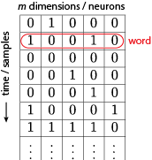

Bayesian Entropy estimator for binary vector observations
=========================================================

Estimating Shannon's entropy from data is difficult, especially when you have less data compared to all possible symbols.
However, if your data are in the form of binary vectors, you're in luck!
BDentropy provides two state-of-the-art Bayesian entropy estimators for binary vectors.
It was primiarily developed for estimating entropy of neural spike trains, however, if your data has a similar structure that our prior assumes, it could work very well for you too.

The MATLAB code is a reference implementation for the results described in the following paper:

- Evan Archer, Il Memming Park, Jonathan W. Pillow. [Bayesian entropy estimation for binary spike train data using parametric prior knowledge. Neural Information Processing Systems](http://papers.nips.cc/paper/4873-bayesian-entropy-estimation-for-binary-spike-train-data-using-parametric-prior-knowledge) [(NIPS) 2013](http://books.nips.cc/nips26.html)

Tutorial
========
Let's say that your observation is in the following matrix form:

Here, each column of your matrix corresponds to an `m` dimensional observation.

The code corresponding to the above tutorial is [tutorial.m](src/tutorial.m)

External links
==============
A closely related sister-paper also appeared at the same conference:

* Il Memming Park, Evan W. Archer, Kenneth Latimer, Jonathan W. Pillow. [Universal models for binary spike patterns using centered Dirichlet processes](http://papers.nips.cc/paper/5050-universal-models-for-binary-spike-patterns-using-centered-dirichlet-processes) NIPS 2013
